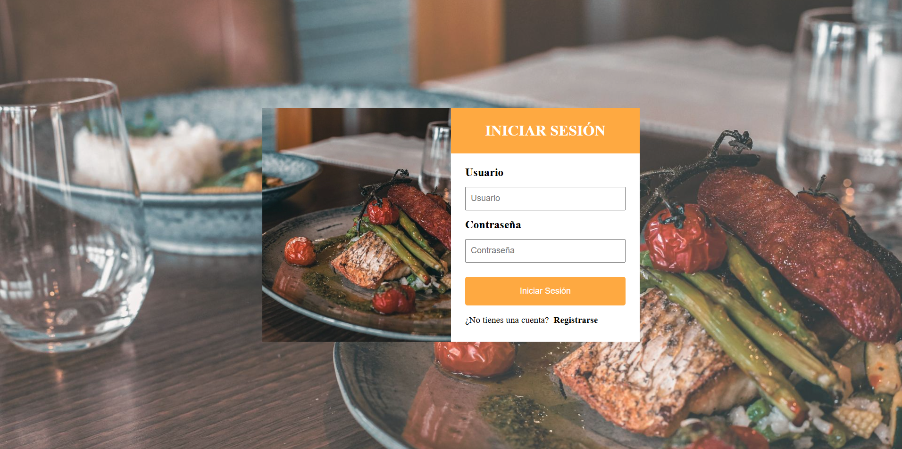
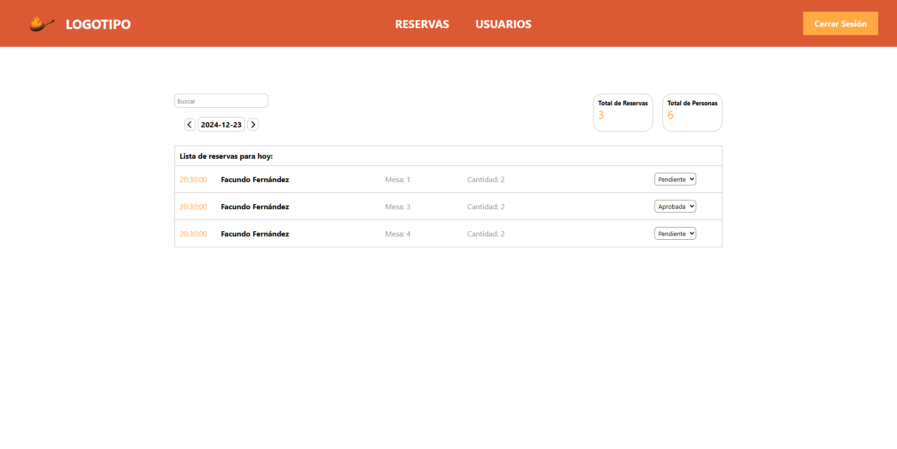
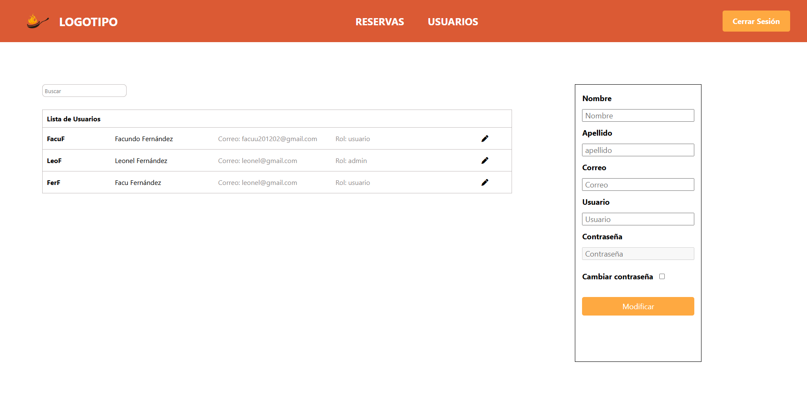
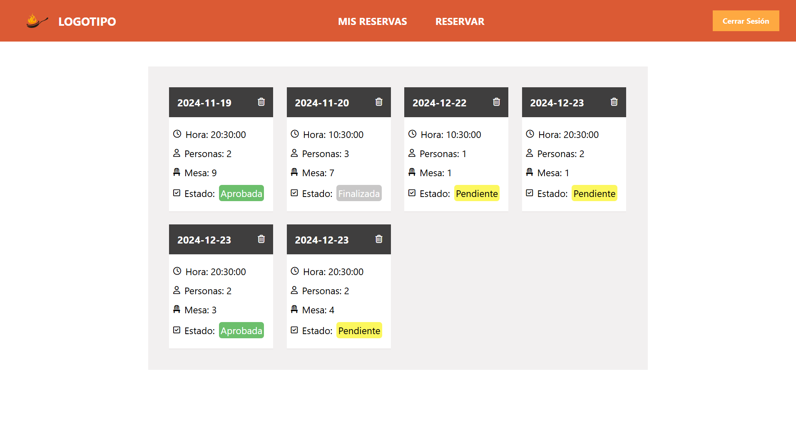
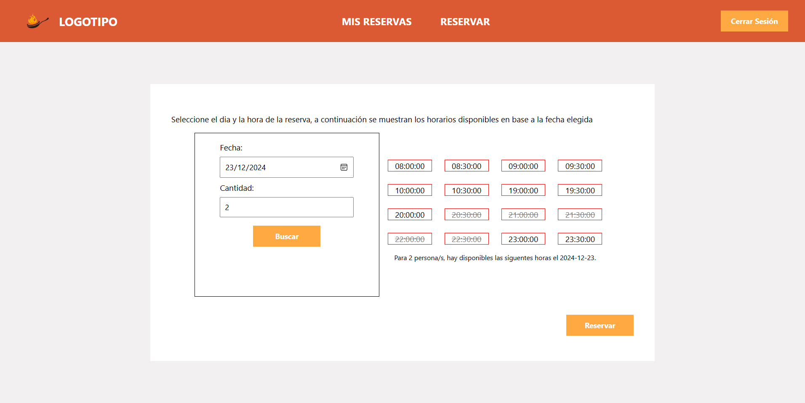

# Sistema de Reservas para Restaurante  

Una aplicación web para gestionar reservas en un restaurante. Los usuarios pueden registrarse, realizar reservas, consultar su estado y administrar sus citas. También cuenta con un panel de administración para gestionar usuarios y reservas por día.  

## Características  

- **Página principal**:  
  - Información sobre el restaurante y sus servicios.  
- **Autenticación**:  
  - Registro y login de usuarios o administradores.  
- **Gestión de reservas**:  
  - Crear, modificar y cancelar reservas.  
  - Visualización de horarios disponibles en formato de grilla.  
  - Estados de reservas: aprobado, pendiente, cancelado, finalizado.  
- **Panel de administración**:  
  - Gestión de usuarios registrados.  
  - Visualización y gestión de reservas por día.  

## Capturas de Pantalla  

  
*Pantalla principal con información del restaurante.*  

  
*Pantalla de inicio de sesión para usuarios registrados y formulario de registro para usuarios nuevos*  

  
*Sección de administradores para gestionar reservas realizadas*  

  
*Sección de administradores para gestionar usuarios existentes* 

  
*Vista donde los usuarios pueden consultar y gestionar sus reservas.*  

  
*Formulario para seleccionar fecha, hora y número de personas al realizar una reserva.*  

## Tecnologías  

- **Frontend**: HTML, CSS, JavaScript, TypeScript.  
- **Backend**: Node.js, Express, TypeScript.  
- **Base de datos**: MySQL.  

## Enlaces  

- [Deploy de la App en Render](https://restaurant-reservation-app-rlsv.onrender.com/)  
  *Tener en cuenta que esta es una implementación en un servidor gratuito de Render, por lo que puede tardar algunos segundos en iniciar la aplicación.*
